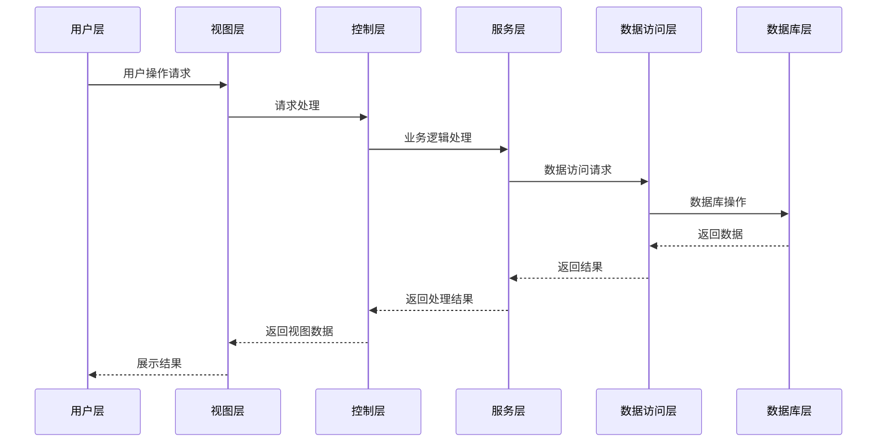

# 广州市青少年科技教育综合业务管理服务平台系统架构时序图

## 系统整体架构

## 架构层级说明

### 1. 用户层
- 包含系统的所有用户界面
- 负责用户交互和数据展示
- 主要模块：
  - 科普项目申报界面
  - 校园生态环境管理界面
  - 科教资源统筹界面
  - 公益课堂管理界面
  - 专家库管理界面

### 2. 视图层(View)
- 处理用户界面的展示逻辑
- 负责数据格式化和页面渲染
- 主要功能：
  - 表单验证
  - 数据格式化
  - 页面布局
  - 响应式设计

### 3. 控制层(Controller)
- 处理用户请求和业务逻辑
- 协调视图层和服务层
- 主要模块：
  - 项目申报控制器
  - 活动管理控制器
  - 资源管理控制器
  - 用户认证控制器
  - 数据统计控制器

### 4. 服务层(Service)
- 实现核心业务逻辑
- 处理复杂业务规则
- 主要服务：
  - 项目申报服务
  - 活动管理服务
  - 资源统筹服务
  - 专家库管理服务
  - 数据统计分析服务

### 5. 数据访问层(DAO)
- 处理数据库操作
- 实现数据持久化
- 主要功能：
  - 数据库连接管理
  - SQL查询执行
  - 数据映射
  - 事务管理

### 6. 数据库层(DB)
- 存储系统数据
- 主要数据表：
  - 用户信息表
  - 项目申报表
  - 活动管理表
  - 资源信息表
  - 专家信息表
  - 统计数据表

## 技术实现说明

1. 前端技术栈：
   - Vue.js/React
   - Element UI/Ant Design
   - Axios
   - ECharts

2. 后端技术栈：
   - Spring Boot
   - Spring MVC
   - MyBatis
   - Spring Security

3. 数据库：
   - MySQL
   - Redis(缓存)

4. 部署环境：
   - Docker容器化
   - Nginx反向代理
   - Jenkins自动化部署 